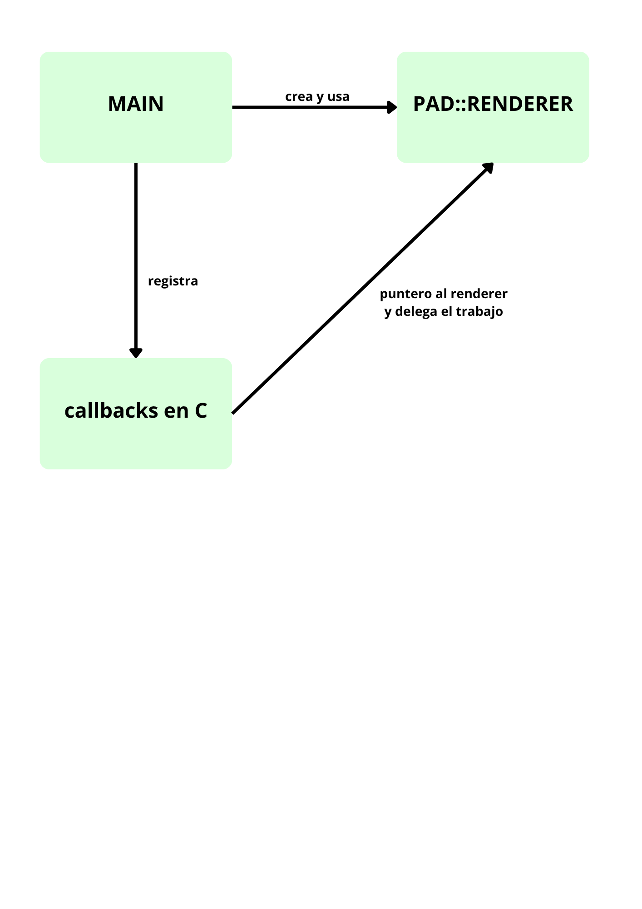

### Extensiones para la ejecucion en visual studio y no en clion

- **C/C++** (Microsoft) 
- **CMake Tools** (Microsoft)¡
- **CMake** (twxs) —

 **Importante:** desinstala *C/C++ Runner*, desactívala para este entorno de trabajo ya que invoca `g++` sin leer el `CMakeLists.txt`, por lo que no encuentra los includes de GLAD ni GLFW, y produce errores al no encontrar las rutas

### Configuración de vcpkg

El archivo `.vscode/settings.json` incluye la ruta a vcpkg para que CMake pueda encontrarlo:

```json
{
  "cmake.configureArgs": [
    "-DCMAKE_TOOLCHAIN_FILE=C:/vcpkg/scripts/buildsystems/vcpkg.cmake"
  ]
}
```

### Como compilar y ejecutar en visual code studio


1. `Ctrl+Shift+P` → **CMake: Configure**. Si pregunta por un kit, seleccionar el
   compilador GCC de MSYS2/UCRT64.
3. `Ctrl+Shift+P` → **CMake: Build** para compilar el poryecto.
4. `Ctrl+Shift+P` → **CMake: Run Without Debugging** para ejecutarlo.

También se puede compilar y ejecutar desde los botones **Build** y **▶** de la barra inferior, equivaldran a los comandos anteriores.


## Ejercicio de reflexión

### El problema

GLFW espera normalmente firmas concretas, no cpn firmas pertenecientes a C, por ejemplo:

```cpp
void window_refresh_callback(GLFWwindow *window);
```

Por lo que no se admiten métodos de como `PAG::Renderer::refrescarVentana()`
ya que un método lleva un puntero oculto a `this` que no espera
GLFW.

### La solución

La solución es separar dos capas:

1. **PAG::Renderer** aquí tendremos toda la lógica para dibujar (por ejemplo,
   `refrescarVentana()`), y no sabe nada de GLFW ni fuera de la lógica de
   dibujado, así será completamente desacoplada y reutilizable. 

2. Un módulo que se encargará de:
   - Crear la instancia de `PAG::Renderer`.
   - Guardar un puntero para acceder desde las funciones, como `glfwSetWindowUserPointer(window, renderer)`.


```cpp
   void window_refresh_callback(GLFWwindow *window)
   {
       auto *renderer = static_cast<PAG::Renderer*>(glfwGetWindowUserPointer(window));
       renderer->refrescarVentana();
   }
```

Aquí se puede observar:

- `glfwGetWindowUserPointer(window)` le pregunta a la ventana para que le devuelva un `void*` (un puntero genérico ya que GLFW no sabe qué clase es).
- `static_cast<PAG::Renderer*>(...)` el static cast realmente le dice al compilador que el tipo será `PAG::Renderer*`", y así llamar a sus métodos con normalidad.

Con `glfwSetWindowUserPointer` evitamos una variable global, ya que el
puntero apuntará a la ventana de GLFW y se recupera con `glfwGetWindowUserPointer(window)` que devuelve el puntero genérico así si en algún momento tuvieras varias ventanas abiertas a la vez, cada una podría tener su propio renderer asociado. Con una variable global solo podrías tener un renderer "activo" para toda la aplicación.

### Diagrama de clases 
