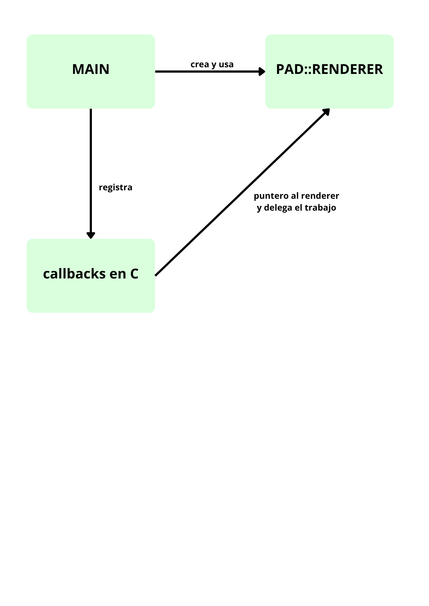
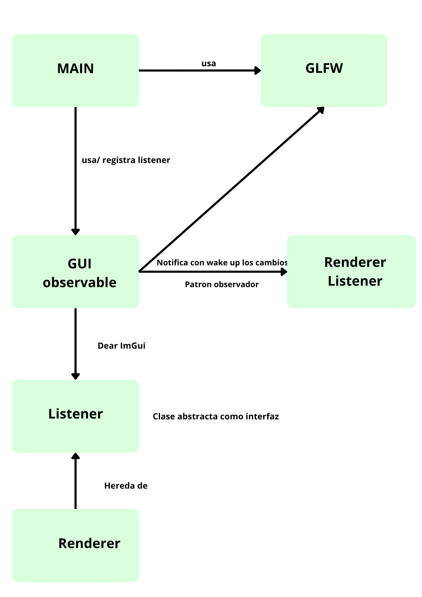

### Extensiones para la ejecucion en visual studio y no en clion

- **C/C++** (Microsoft) 
- **CMake Tools** (Microsoft)¡
- **CMake** (twxs) —

 **Importante:** desinstala *C/C++ Runner*, desactívala para este entorno de trabajo ya que invoca `g++` sin leer el `CMakeLists.txt`, por lo que no encuentra los includes de GLAD ni GLFW, y produce errores al no encontrar las rutas

### Configuración de vcpkg

El archivo `.vscode/settings.json` incluye la ruta a vcpkg para que CMake pueda encontrarlo:

```json
{
  "cmake.configureArgs": [
    "-DCMAKE_TOOLCHAIN_FILE=C:/vcpkg/scripts/buildsystems/vcpkg.cmake"
  ]
}
```

### Como compilar y ejecutar en visual code studio


1. `Ctrl+Shift+P` → **CMake: Configure**. Si pregunta por un kit, seleccionar el
   compilador GCC de MSYS2/UCRT64.
3. `Ctrl+Shift+P` → **CMake: Build** para compilar el poryecto.
4. `Ctrl+Shift+P` → **CMake: Run Without Debugging** para ejecutarlo.

También se puede compilar y ejecutar desde los botones **Build** y **▶** de la barra inferior, equivaldran a los comandos anteriores.


## Ejercicio de reflexión

### El problema

GLFW espera normalmente firmas concretas, no cpn firmas pertenecientes a C, por ejemplo:

```cpp
void window_refresh_callback(GLFWwindow *window);
```

Por lo que no se admiten métodos de como `PAG::Renderer::refrescarVentana()`
ya que un método lleva un puntero oculto a `this` que no espera
GLFW.

### La solución

La solución es separar dos capas:

1. **PAG::Renderer** aquí tendremos toda la lógica para dibujar (por ejemplo,
   `refrescarVentana()`), y no sabe nada de GLFW ni fuera de la lógica de
   dibujado, así será completamente desacoplada y reutilizable. 

2. Un módulo que se encargará de:
   - Crear la instancia de `PAG::Renderer`.
   - Guardar un puntero para acceder desde las funciones, como `glfwSetWindowUserPointer(window, renderer)`.


```cpp
   void window_refresh_callback(GLFWwindow *window)
   {
       auto *renderer = static_cast<PAG::Renderer*>(glfwGetWindowUserPointer(window));
       renderer->refrescarVentana();
   }
```

Aquí se puede observar:

- `glfwGetWindowUserPointer(window)` le pregunta a la ventana para que le devuelva un `void*` (un puntero genérico ya que GLFW no sabe qué clase es).
- `static_cast<PAG::Renderer*>(...)` el static cast realmente le dice al compilador que el tipo será `PAG::Renderer*`", y así llamar a sus métodos con normalidad.

Con `glfwSetWindowUserPointer` evitamos una variable global, ya que el
puntero apuntará a la ventana de GLFW y se recupera con `glfwGetWindowUserPointer(window)` que devuelve el puntero genérico así si en algún momento tuvieras varias ventanas abiertas a la vez, cada una podría tener su propio renderer asociado. Con una variable global solo podrías tener un renderer "activo" para toda la aplicación.

### Diagrama de clases 



## Práctica 2: patrones Singleton y Observador
### Cambios realizados respecto a la Práctica 1

Creamos la clase renderer usando el patron singleton, que centraliza todas las llamadas a OpenGL. main.cpp ya no llama a ninguna función de OpenGL directamente, solo a GLFW, GLAD y Renderer.
Comenzamos a trabajar con Dear ImGui como biblioteca de interfaz, encapsulada en la clase GUI (también Singleton), que centraliza toda la comunicación con ImGui.
Añadimos el patrón Observador para comunicar los cambios de la interfaz a Renderer, gracias a la interfaz PAG::Listener y el método wakeUp() que tendrá parámetros variables para que en un futuro podamos trabajar con distintos casos.
Ahora mostraremos los mensajes que antes estaban en la consola en una ventana flotante de ImGui.
El bucle principal ahora será continuo ya que Dear ImGui debe reconstruirse en cada fotograma.

### Patrón Singleton

Una clase tendrá una única instancia en toda la ejecución, accesible desde cualquier lugar. Se implementa con:

Un atributo static privado, puntero a la propia clase, la unica instancia.
Un constructor privado, que impide crear objetos desde fuera de la clase.
Un método público y estático getInstancia() el cual verifica si ya se ha creado o crea el objeto. Esto es importante porque Renderer necesita que ya exista un contexto OpenGL activo antes de poder configurarse.


### Patrón Observador

Cambiamos el funcionamiento para notificar a los listeners cuando el color del fondo cambia sin que esos objetos estén constantemente preguntando si algo ha cambiado.
 En su lugar, es el propio objeto observado quien avisa activamente en el instante exacto del cambio.

Implementacion:

Listener: interfaz implementada mediante una clase abstracta con un único método virtual puro, wakeUp, que deben implementar todos los observadores.
WindowType: enum que identificará el tipo y por tanto origen de cada notificación.
GUI: será sujeto observable. Tiene un vector<Listener*> _listeners con los observadores suscritos. Cuando el el color del fondo sea modificado, llamará a wakeUp en cada observador suscrito.
Renderer: hereda de Listener e implementa wakeUp, procesando la notificación según el WindowType recibido y actualizando su color de fondo interno.

La suscripción se realiza en main.cpp:

Dear ImGui es una biblioteca de interfaz sin objetos persistentes entre fotogramas, en cada vuelta del bucle principal se vuelve a "describir" la interfaz completa. Por este motivo, el dibujado de la interfaz pasa a depender de un bucle continuo, en lugar de eventos de refresco de GLFW.

Toda esta comunicación queda encapsulada en GUI, de forma que si en el futuro se cambiara de biblioteca de interfaz, solo habría que modificar esa clase.

### Diagrama de clases 


Gui tendrá una lista de objets de tipo listener dentro de una lista, cada vez que el color de fondo sea cambiado, recorrerá esta lista y notificará a todos los sucritos mediante la función wakeup. Listener se encuentra implementado en renderer por lo que al recibir la notificación actualizará el color interno llamando a glClearColor

